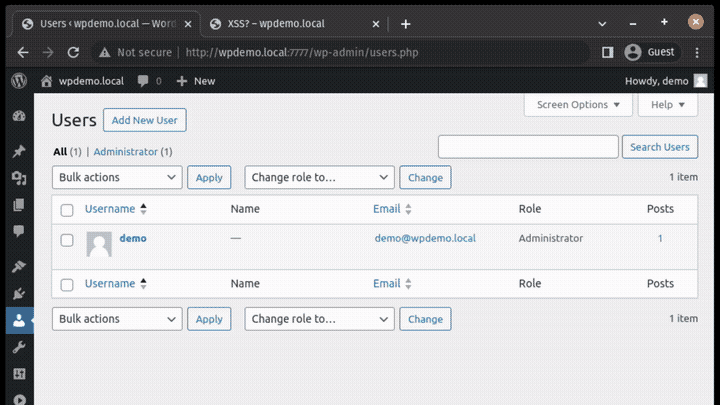

# WordPress
## New Admin XSS Payload
This JS payload will create a WordPress admin if executed in the browser of another logged-in WordPress admin. (for example, through an XSS) 

The reason this required two requests is that the endpoint for user creation requires a specific nonce. (`_wpnonce_create-user`). This is retrieved via `/wp-admin/user-new.php`. After that, a POST request is sent to `/wp-admin/user-new.php`, which creates the user. 

